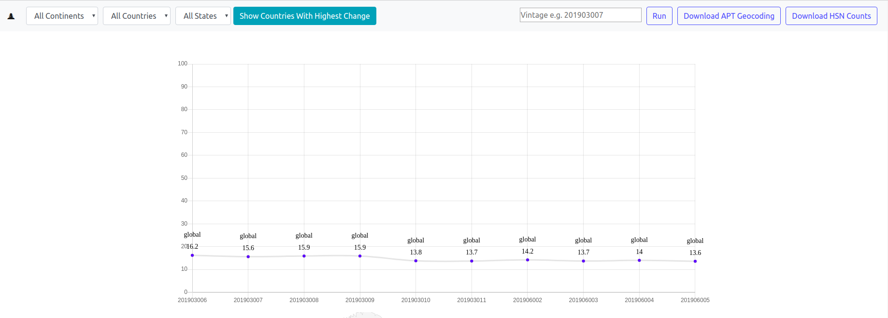
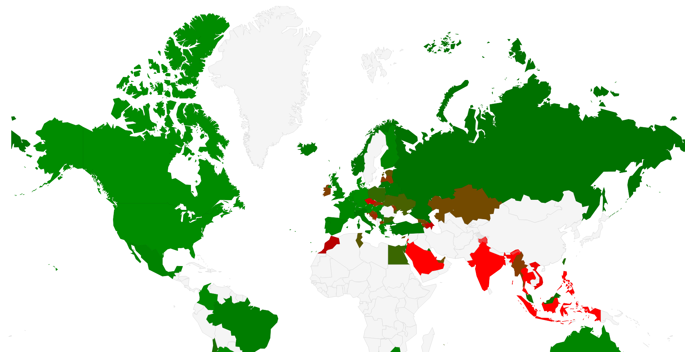

Sherlock is an internal metrics tool used by TomTom to measure how effective the House Number Reconciler program is at updating the 
TomTom database. The House Number Reconciler (HNR) is a Java-based program that compresses a series of full street addresses 
(house number, street, city, state, country, zip code) into a range of just house numbers along a line. This way, the navigation
systems of vehicles do not need as much data storage for house addresses. It is much cheaper and less data intensive to just
store house addresses as a range of numbers on a street, than the full address for each house in the country.

Sherlock compares the number of addresses TomTom has in its mapping database to the house number ranges that have been processed.
A 0% indicates that the HNR tool has successfully converted all known address points to house ranges in a given region. A 100%
means that the HNR tool has not converted any address points to house ranges.

I was responsible for developing the frontend with React with the goal of making Sherlock a quick and easy to use SPA. In this repo
you will find the React files I developed and every effort has been made to adhere to ES6 JavaScript functional programming
best practices.

Below you will find two screenshots of the SPA. The first is the graph with the region filtering options. The second is the map
that provides a visual representation of the data.

